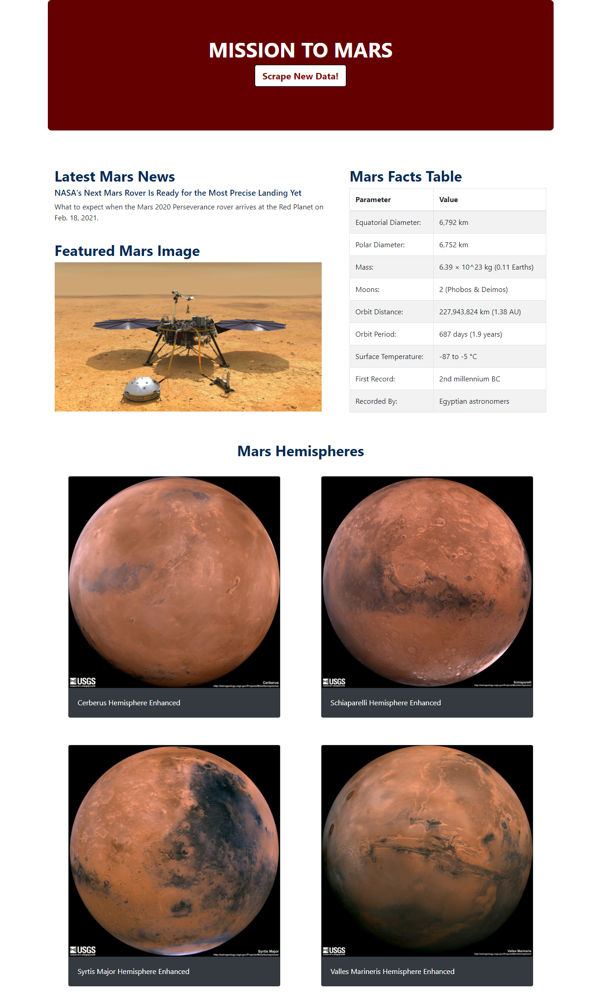

# Web-scraping - Mission to Mars

## Background 

Mars is the fourth planet from the Sun and the second-smallest planet in the Solar System, being larger than only Mercury. In English, Mars carries the name of the Roman god of war and is often referred to as the "Red Planet".
From <https://en.wikipedia.org/wiki/Mars> 

In this challenge it was created a web application that scrapes various websites for data related to the Mission to Mars and displays the information in a single HTML page.

## Step 1 - Scraping

The initial scraping is conducted by using Jupyter Notebook, BeautifulSoup, Pandas, and Requests/Splinter. The Jupyter Notebook file called [mission_to_mars](Missions_to_Mars/mission_to_mars.ipynb).ipynb is used to complete all the scraping and analysis tasks.

### NASA Mars News
* Scrape the [NASA Mars News Site](https://mars.nasa.gov/news/) and collect the latest News Title and Paragraph Text.

## Mars Facts
* Visit the Mars Facts webpage [here](https://space-facts.com/mars/) and use Pandas to scrape the table containing facts about the planet including Diameter, Mass, etc.

### Mars Hemispheres
* Visit the USGS Astrogeology site [here](https://astrogeology.usgs.gov/search/results?q=hemisphere+enhanced&k1=target&v1=Mars) to obtain high resolution images for each of Mar's hemispheres.

## Step 2 - MongoDB and Flask Application

MongoDB with Flask templating were used to create a new HTML page that displays all of the information that was scraped from the URLs above.

Then after, the Jupyter notebook was coverted into a Python script called `scrape_mars.py` with a function called `scrape` that will execute all of your scraping code from above and return one Python dictionary containing all of the scraped data.

Next, It was created a route called `/scrape` that will import your `scrape_mars.py` script and call your `scrape` function.

The returned values were stored in Mongo as a Python dictionary.

A root route `/` that will query the Mongo database and pass the mars data into an HTML template to display the data was created.

Finally, It was created a template HTML file called `index.html` that will take the mars data dictionary and display all of the data in the appropriate HTML elements. The final display looks as followed:

### Copyright

Trilogy Education Services © 2020. All Rights Reserved.

